# Introduction
`chiara-speech2text` is a software system for Automatic Speech Recognition (ASR) and speech2text for users with atypical speech.

## Problem 
The system has been developed to facilitate communication of Chiara through her tablet.

Chiara is a very active girl with a passion for chatting and making new friends :)

Unfortunately, she suffers from dysarthria and speech impairments due to cerebral palsy.
She has difficulties with articulation (pronunciation), fluency (speech rate and rhythm), abnormal tone and echolalia (repetitions).

Chiara can not write nor read, and she can only communicate via speech. She mostly communicates through voice messages, on her tablet, via Whatsapp.

However -due to her dysarthria- people have difficulties understanding her voice messages.
Due to this, she has limited possibilities to communicate and interact with her peers, which poses a great limit to her social interactions.

## Solution
`chiara-speech2text` is a set of software tools to help Chiara communicate and to enable ASR for her (and other users with atypical speech).

The main user interface is a custom Android keyboard, which allows to transcribe user's speech seamlessly within standard communication apps - such as Whatsapp.

The keyboard allows transcription without exiting the communication app - overcoming limitations of other ASR tools (which typically require users to exit the app, visit a web-transcription-service, and copy/paste the transcription back to the communication app).

Beyond the keyboard itself, the system has several other software modules to enable ASR, including functionalities to:
- record labeled data required to fine-tune the model (i.e. record user's speech + data cleaning and labeling functionalities)
- fine-tune custom voice-recognition models (e.g. OpenAi Whisper) to user's specific speech
- speech transcription via a local custom Android keyboard and a remote GPU-server (that does inference exploiting the fine-tuned model)  
- LLM-enabled features to facilitate communication (e.g. spellchecking, provide context-aware corrections of transcripts, provide conversations-starters suggestions) 

### Videos
Here are some videos demonstrating use and features of the system:
- [Chiara speaking with a friend through the custom-keyboard](https://youtube.com/shorts/DFmg-b4cESc)
- [Chiara demo'ing the custom-keyboard #1](https://youtube.com/shorts/sgt3RyYvzFk)
- [Chiara demo'ing the custom-keyboard #2](https://youtube.com/shorts/3RqOmX9pwYU)
- [Luca demo'ing the custom-keyboard's features](https://youtu.be/VF_eFYWsID0)
- [Chiara recording data to fine-tune models](https://youtu.be/ulTNYcMk2qk)
- [Comparison between fine-tuned and vanilla models](https://youtu.be/igoo26hUSic)

# Code
xxx

# System description
The system is composed of the following modules:
- `frontend`: webapp to create and curate the datasets used to train the model, including functionalities to:
    - record users' speech (users can also upload custom words/phrases on which they'd like to train the model) 
    - curate the dataset (e.g. edit transcripts, listen- and delete- low quality recordings which are not suited for model-training purposes)
    - test transcription via the fine-tuned voice-recognition model(s), and compare results to non-fine-tuned (vanilla) models (e.g. OpenAi Whisper, Nvidia Canary)
- `model-trainer`: Python notebooks to:
    - import datasets generated by `frontend` module
    - train fine-tuned voice recognition models (based on OpenAI Whisper, Nvidia Canary, Parakeet) on the recorded dataset
- `fine-tuned models`: binary files containing the fine-tuned models (bias, weights, architecture, etc), as output'd by `model-trainer`
- `model-server`: Python webserver exposing services that:
    - (i) accept audio inputs, and
    - (ii) return corresponding transcripts exploiting transcription via the `fine-tuned models`  
- `keyboard`: custom Android keyboard that allows to:
    - record user's speech
    - send recorded audios to `model-server`
    - show and edit transcripts returned by `model-server`   
    - deploy transcript exposing a standard Android input-method (keyboard), for seamless use e.g. in Whatsapp
    - provide suggestions for words similar to the recognized ones (using Levenshtein distance)
- `models-evaluator`: Python notebooks to evaluate amd compare performance (e.g. WER) of different fine-tuned models
- `storage`: Google Firebase storage bucket to store audio recordings and transcripts
- `open-webui` and `llm-utils`: modules to host local LLMs to provide additional features e.g.:
    - spellchecking of transcripts
    - provide context-aware words suggestions
    - provide conversation-starter phrases  
- `utils`: Python tools to e.g.
    - process WhatsApp audio messages and make them suitable as input for model-training
    - batch-upload / download data to/from the server

## Deployment
As of 2026.03.06, the modules are deployed as shown in the diagram and table below.


| Module            | Location                                            |
| ----------------- | --------------------------------------------------- |
| frontend          | Luca's Nvidia DGX Spark, or Google Cloud Run        |
| model-trainer     | Luca's Nvidia DGX Spark, or Google Colab            |
| fine-tuned models | Luca's Nvidia DGX Spark, or Hugging Space           |
| model-server      | Luca's Nvidia DGX Spark, or Google Cloud Run        |
| keyboard          | Chiara's tablet                                     |
| models-evaluator  | Luca's Nvidia DGX Spark                             |
| storage           | Google Firebase bucket                              |
| open-webui        | Luca's Nvidia DGX Spark                             |
| llm-utils         | Luca's Nvidia DGX Spark                             |
| utils             | Luca's development PC (e.g. Nvidia DGX Spark)       |

## Models fine-tuning process
The process employed to fine-tune the ASR models is shown in the diagram below.


The following process was employed to fine-tune the models:
1. Luca, Ugo and Mariella defined a set of words / phrases (inputs) they deemed useful for Chiara's communication (based on what she typically communicates over Whatsapp)
2. Chiara was asked to listen to inputs (through text2speech) and generate corresponding speech (for several times)
    - Audios + corresponding text was stored on the firebase storage
    - Luca cleaned audios (e.g. removed bad recordings) to ensure clean data was available for models training 
3. A first model was fine-tuned using the labeled data (audios + text)
4. Transcription performance (WER) of the fine-tuned model was evaluated on Chiara's live-speech, asking her to speech previously-defined inputs and new ones
5. Based on performance, steps 1-4 were repeated iteratively
6. After ~1h of generated data, the fine-tuned model was used to transcribe a 1st batch of existing Whatsapp audios (which Chiara exchanged with Luca over the previous years)
7. Luca and Ugo manually edited the transcriptions (listened to audios + edited trasncripts) to ensure transcripts corresponded to Chiara's speech
8. The edited data was used to fine-tune a new model
9. Steps 7-8 were repeated iteratively till ~8h of labeled data (recordings+transcripts) were available. Upon this threshold the system was capable of reliably trasncribing Chiara's speech with WER ~10

## Diagrams
### Keyboard use


## Architecture

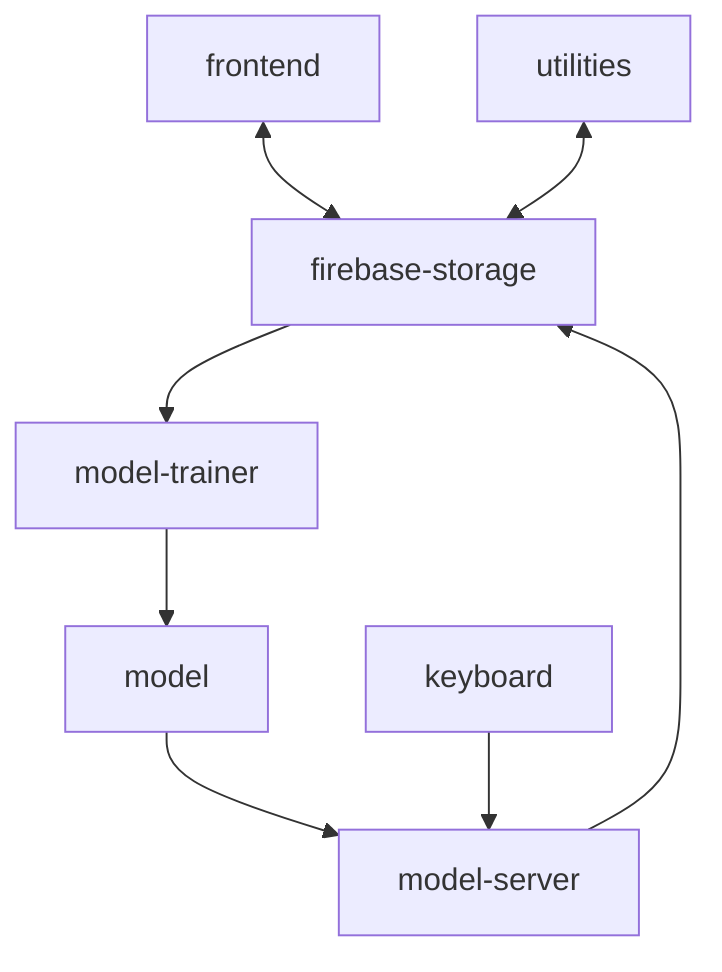

## Requirements
- ~8h of labeled data (audios + trasncripts) was required to achieve WER of ~10
- A GPU is required for fast (<1s) inference (transcription). CPUs generate transcriptions within ~8s

## Team
- Luca (owner of the repo) developed the project (with looot of help from AI coding agents :P)
- Chiara recorded audios, and tested the system
- Ugo and Mariella (Luca's and Chiara's parents) helped identifying requirements and cleaning data

# Results
The graph below shows the WER for the fine-tuned (left) and standard / vanilla (right) Whisper models.

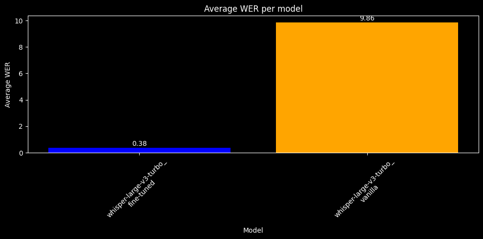

The snippet below shows a comparison of the transcripts between fine-tuned and vanilla models across different recordings (entries).
Each entry:
- is enclosed in `{}`
- contains:
   - `truth`: the real word / phrase pronounced by Chiara (manually labeled by Luca)
   - `whisper-large-v3-turbo_fine-tuned`: the output from the fine-tuned model
   - `whisper-large-v3-turbo_vanilla`: the output from the vanilla model 


```
{
    "                               truth": "zia perché",
    "   whisper-large-v3-turbo_fine-tuned": "zia perché",
    "   whisper-large-v3-turbo_vanilla   ": " perché"
},
{
    "                               truth": "perché mi hai mandato questo video",
    "   whisper-large-v3-turbo_fine-tuned": "perché mi hai mandato questo video",
    "   whisper-large-v3-turbo_vanilla   ": " Piki mi mando un altro video"
},
{
    "                               truth": "che cosa mi vuoi comunicare",
    "   whisper-large-v3-turbo_fine-tuned": "che cosa che cosa mi vuoi comunicare",
    "   whisper-large-v3-turbo_vanilla   ": " Che cosa mi vuoi comunicare?"
},
{
    "                               truth": "zia mi puoi mandare solo video che si vedono con",
    "   whisper-large-v3-turbo_fine-tuned": "zia mi puoi mi puoi mandare solo vediamo che ci vediamo con",
    "   whisper-large-v3-turbo_vanilla   ": " Dìa mi puoi andare a me, mi puoi andare a te lo video che ti vedo con me."
},
{
    "                               truth": "youtube",
    "   whisper-large-v3-turbo_fine-tuned": "i ho giusto",
    "   whisper-large-v3-turbo_vanilla   ": " Ehi ehi uai uai uai uai uai tu..."
},
{
    "                               truth": "youtube",
    "   whisper-large-v3-turbo_fine-tuned": "youtube",
    "   whisper-large-v3-turbo_vanilla   ": " YouTube"
},
{
    "                               truth": "il programma della musica",
    "   whisper-large-v3-turbo_fine-tuned": "il progresso della musica",
    "   whisper-large-v3-turbo_vanilla   ": " Ippocampo della moptica!"
},
{
    "                               truth": "io questo programma non ce l'ho",
    "   whisper-large-v3-turbo_fine-tuned": "io questo programma non ce l ho",
    "   whisper-large-v3-turbo_vanilla   ": " io io questo punto non è... non... non è..."
},
{
    "                               truth": "perché io altri programmi non ne ho",
    "   whisper-large-v3-turbo_fine-tuned": "perché io altri programmi non ce lo",
    "   whisper-large-v3-turbo_vanilla   ": " Sì, perché io ho fatto, non mi non mi non mi non mi non mi non"
},
{
    "                               truth": "ok zia a più tardi",
    "   whisper-large-v3-turbo_fine-tuned": "ok ok zia più tardi",
    "   whisper-large-v3-turbo_vanilla   ": " ok ok ok ok ok ok ok ok ok ok ok ok ok ok ok"
},
{
    "                               truth": "ok zia a dopo",
    "   whisper-large-v3-turbo_fine-tuned": "ok zia dopo",
    "   whisper-large-v3-turbo_vanilla   ": " che già bubbo"
},
{
    "                               truth": "alessia studia ancora un pochino dopo te ne vai a casa",
    "   whisper-large-v3-turbo_fine-tuned": "alessia studia ancora un pochino dopo te la veri a casa",
    "   whisper-large-v3-turbo_vanilla   ": " Arretta, tu be' angon po' qui ne vanno fu, tervai a capo."
},
{
    "                               truth": "dalla foto si vede che sei stanca",
    "   whisper-large-v3-turbo_fine-tuned": "da una volta ti vedi che sei stancata",
    "   whisper-large-v3-turbo_vanilla   ": " Non lo posso dire che ti ti ti ti ti ti ti ti ti"
},
{
    "                               truth": "ok alessia a più tardi",
    "   whisper-large-v3-turbo_fine-tuned": "ok alessia a più tardi",
    "   whisper-large-v3-turbo_vanilla   ": " Ok, è l'epia, allora, più bella, più bella, più bella. Guarda che belli, le ho fatti farà chiare la settimana scorsa, se"
},
{
    "                               truth": "dalla foto si vede che sei sfinita",
    "   whisper-large-v3-turbo_fine-tuned": "della foto ti vede che sei finita",
    "   whisper-large-v3-turbo_vanilla   ": " Dalla foto ti vedi che te è in verità."
},
{
    "                               truth": "hai capito",
    "   whisper-large-v3-turbo_fine-tuned": "hai capito",
    "   whisper-large-v3-turbo_vanilla   ": " Aller copito!"
},
{
    "                               truth": "luca ora io sono disponibile",
    "   whisper-large-v3-turbo_fine-tuned": "luca ora io sono disponibile",
    "   whisper-large-v3-turbo_vanilla   ": " Ora si"
}
```

# Screenshots
## Frontend
Home page
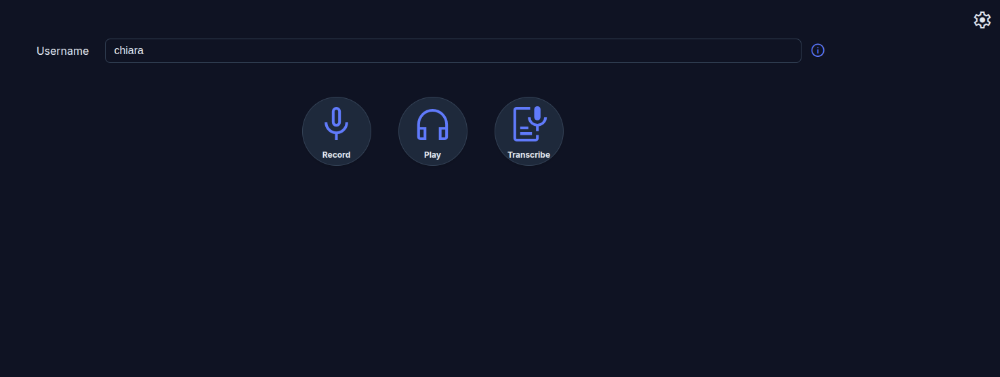

Record section: see inputs, upload new inputs
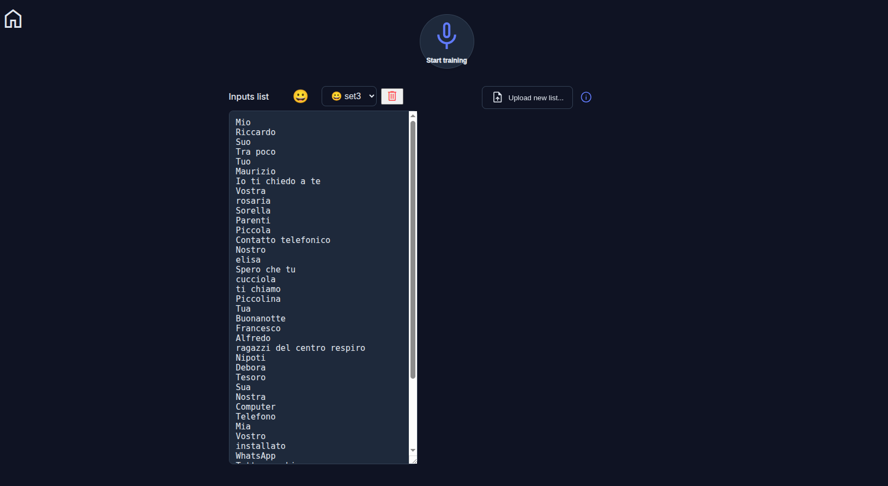

Play section: select folders
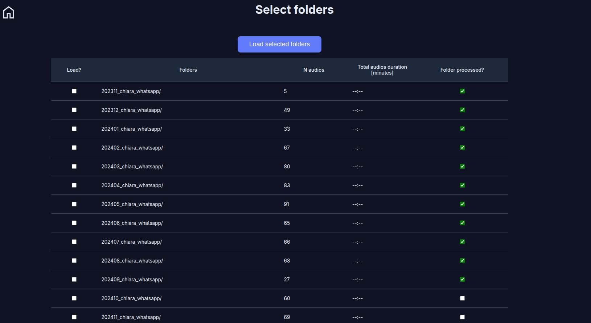

Play section: see / edit trasncripts, listen to audios
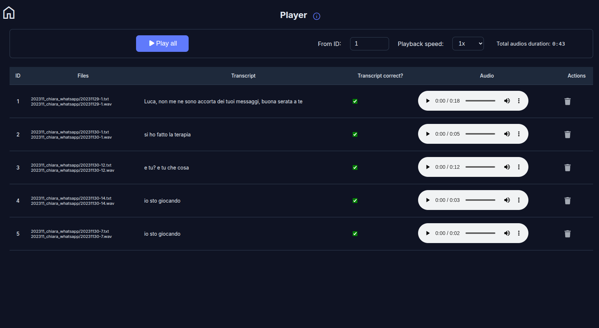

## Keyboard
See transcribed recording
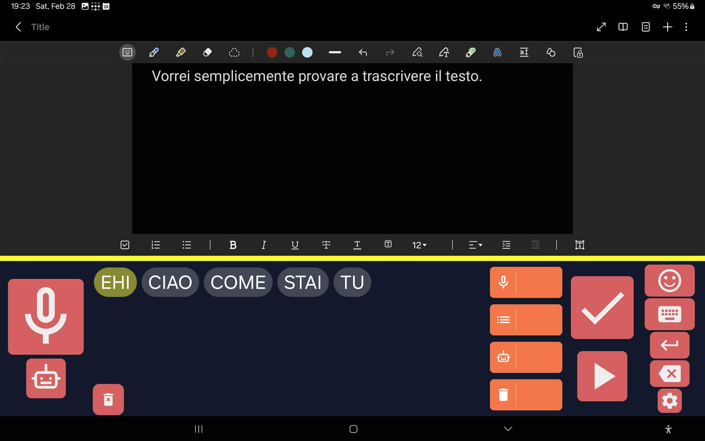

Emojis
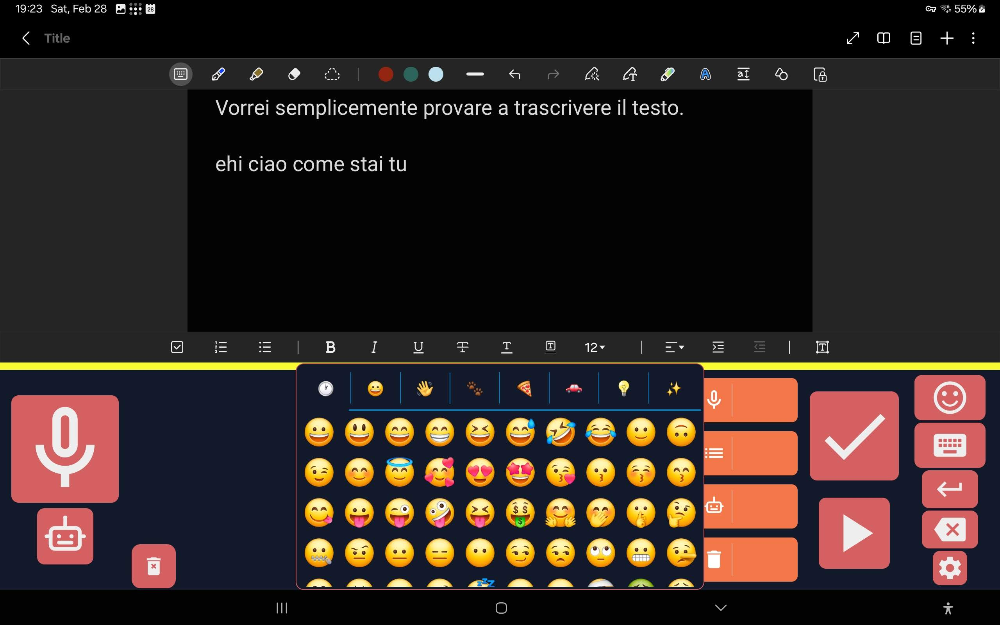

Keys
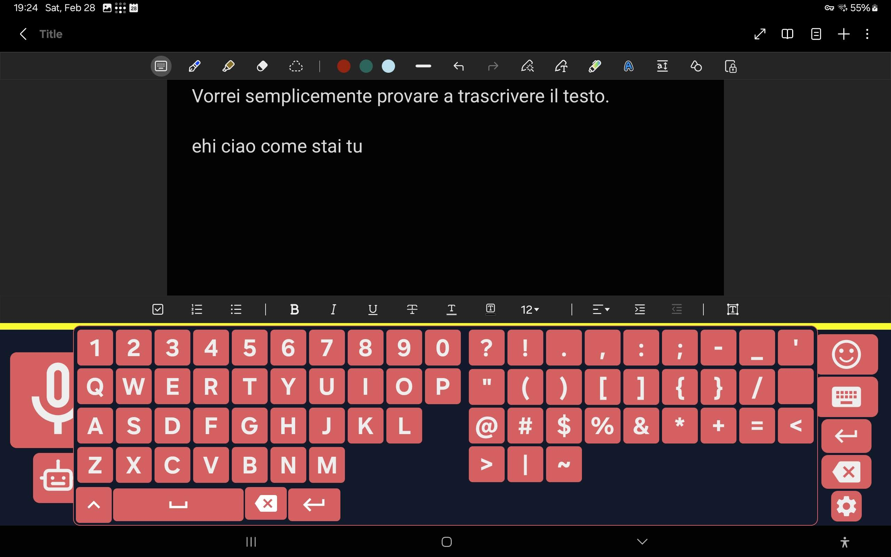

Suggested words
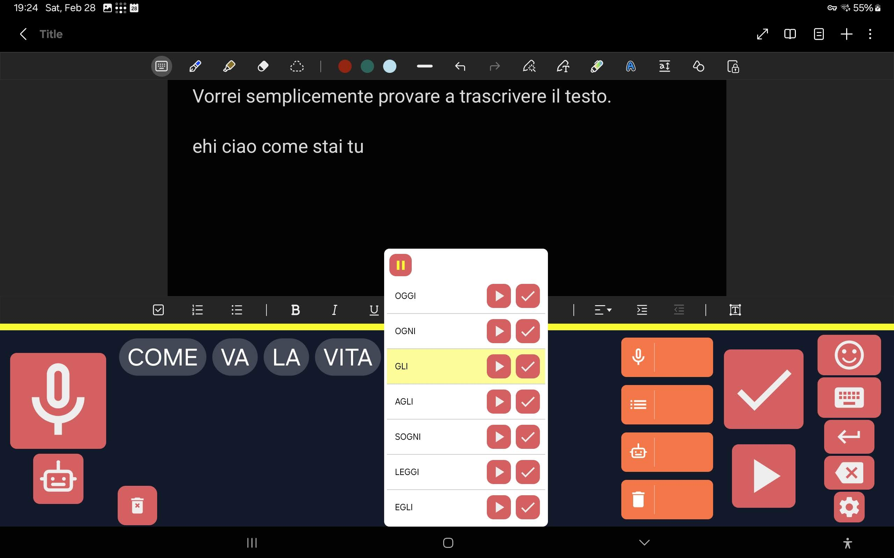

Settings
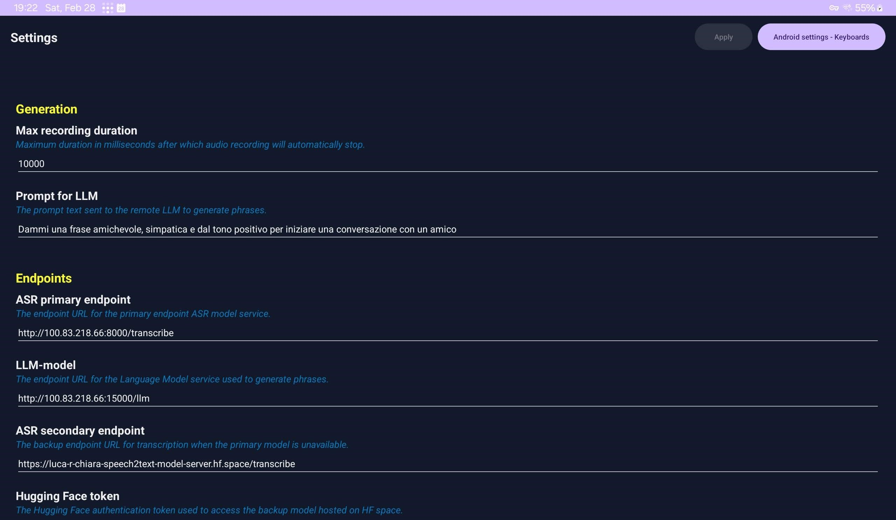

# Future developments
- Real-time subtitling of her video-calls
- Reinforcement learning approaches to use data she generates via the keyboard